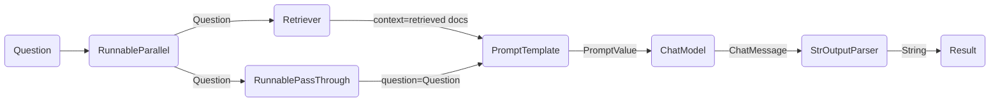

# 快速入门（GetStarted）

```
pip install langchain docarray tiktoken
```
来自langchain_community.vectorstores的DocArrayInMemorySearch类提供了一个用于在内存中搜索的文档集合。StrOutputParser类用于解析输出。ChatPromptTemplate类用于构建Prompt模板。RunnableParallel和RunnablePassthrough类用于运行可调用对象。OpenAIEmbeddings类用于嵌入文本。

vectorstore是从给定的文本创建的DocArrayInMemorySearch对象，这些文本包括"harrison worked at kensho"和"bears like to eat honey"。retriever是一个从vectorstore生成的检索器。

template是一个基于上下文context和问题question的Prompt模板。prompt是从模板创建的ChatPromptTemplate对象。output_parser是一个用于解析ChatMessage的StrOutputParser对象。

setup_and_retrieval是一个RunnableParallel对象，它将retriever作为context参数添加到上下文中，并使用RunnablePassthrough将问题添加到上下文中。

chain是一个Runnable对象的组合，包括setup_and_retrieval、prompt、model和output_parser。

chain.invoke("where did harrison work?")会触发链式调用，并返回结果。

在这个例子中，组合链是:

```python
chain = setup_and_retrieval | prompt | model | output_parser
```

解释这个链式调用，首先我们可以看到上面的prompt模板以`context`和`question`作为要替换的值。在构建prompt模板之前，我们希望检索与搜索相关的文档，并将它们作为上下文的一部分包含在内。

作为一个预备步骤，我们使用内存存储设置了检索器，它可以根据查询来检索文档。这也是一个可运行的组件，可以与其他组件链接在一起，但你也可以尝试单独运行它:

```python
retriever.invoke("where did harrison work?")
```

然后，我们使用RunnableParallel来准备prompt的期望输入，使用检索器来检索文档搜索的结果，并使用RunnablePassthrough传递用户的问题:

```python
setup_and_retrieval = RunnableParallel(
    {"context": retriever, "question": RunnablePassthrough()}
)
```

回顾一下，完整的链式调用是:

```python
setup_and_retrieval = RunnableParallel(
    {"context": retriever, "question": RunnablePassthrough()}
)
chain = setup_and_retrieval | prompt | model | output_parser
```

流程如下:

1. 首先创建一个包含两个条目的RunnableParallel对象。第一个条目`context`将包含检索器获取的文档结果。第二个条目`question`将包含用户原始问题。为了传递问题，我们使用RunnablePassthrough复制该条目。
2. 将上一步生成的字典传递给`prompt`组件。然后，它将用户输入（即问题）和检索到的文档（即上下文）用于构建提示，并输出一个PromptValue。
3. `model`组件使用生成的提示，并传递给OpenAI LLM模型进行评估。模型生成的输出是一个`ChatMessage`对象。
4. 最后，`output_parser`组件接受一个`ChatMessage`，并将其转换为Python字符串，返回invoke方法的结果。



## 下一步

我们建议阅读我们的[LCEL优势](/expression_language/why)部分，以查看使用和不使用LCEL时生成常见功能所需的代码的对比。